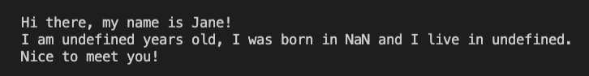

# Action Item: Use Static Typing

## Setup

In this case we are just using some js code as example. 
You can apply the following setup to any JS code base.

## 1. Setting up NPM

1. To use different packages we need to setup the package manager - `npm` in this folder:
    ```bash 
    npm init -y
    ```
------
2. Add a `.gitignore` file to leave the `node_modules` out of your commits:
    ```bash 
    echo "\nnode_modules" >> .gitignore 
    ```
    **Save the `.gitignore` file with the code editor to apply the changes.**
------
3. Add a `start` script to the `package.json` file that run the code:
    ```javascript 
      "scripts": {
            ...,
            "start": "node src/index.js"
        },
    ```
------
 4. Run the script using the `start` command:
    ```bash
    npm run start
    ```

    You should get a print in the console like this:
    

------
5. Add `typescript` as a development dependency by running:
    ```bash 
    npm install typescript --save-dev
    ```
------
6. Add a `build` script to the `package.json` file that will compile the code:
    ```javascript 
      "scripts": {
            ...,
            "build": "tsc"
        },
    ```
------
7. Add a `tsconfig.json` file to configure the Typescript compiler:
    ```bash 
    echo "{}" > tsconfig.json
    ```
------
8. Add the following to the `tsconfig.json` file:
    ```json 
    {
        "compilerOptions": {
        "module": "commonjs",
        "noImplicitAny": true,
        "removeComments": true,
        "preserveConstEnums": true,
        "sourceMap": true,
        "outDir": "dist",
        "allowJs": true
        },
        "include": ["src/**/*"],
        "exclude": ["node_modules"]
    }
    ```
------
9. Run the build script and check the `dist` folder:
    ```bash 
    npm run build
    ```
------
10. Add the `dist` folder to `.gitignore`:
    ```bash 
    echo "\ndist" >> .gitignore 
    ```
    **Save the `.gitignore` file with the code editor to apply the changes.**
------
11. Modify the `tsconfig.json` file so it rejects plain JS code:
    ```json 
    {
        ...
        "allowJs": false
        ...
    }
    ```
------
12. Migrate the code to Typescript:
   10.1 Change all the `.js` files to `.ts`
   10.2 Extend and modify the code to solve the all the type errors
------
13. Change your start command so it uses the compiled code in `package.json`:
    ```javascript 
      "scripts": {
            ...,
            "start": "node dist/index.js"
        },
    ```

## Part 2

1. Set up `eslint` for the typescript code
2. Add a git hook to lint the code before commit
3. Add a git hook to build the code before pushing


## Wrapping up

1. Make sure you push and commit your code
2. Feel free to take the exercise further and experiment yourself with the setup

### Made with :orange_heart: in Berlin by @CodeWithDragos
